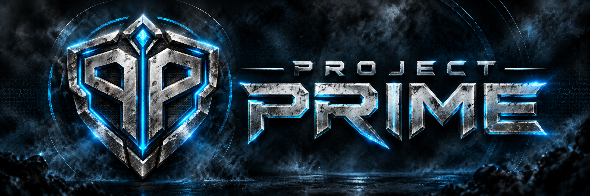

# Project Prime

<p align="center">
  
</p>

<p align="center">
  <strong>Metroid Prime Hunters rebuilt for modern PCs and Android.</strong>
</p>

<p align="center">
  Online multiplayer for up to 8 players, dedicated servers, high-refresh rendering, replays, custom maps, modern controls, and more.
</p>

<p align="center">
  <strong><a href="https://github.com/AntiNotAnti/Prime-Hunters-Online/releases/latest">Download the latest release</a></strong>
</p>

---

## About

**Project Prime** is a community-driven project bringing **Metroid Prime Hunters** to Windows, Linux, macOS, and Android with modern rendering, controls, multiplayer infrastructure, replay tools, custom maps, and quality-of-life improvements.

Project Prime is built on [MphRead](https://github.com/NoneGiven/MphRead) by **NoneGiven** and expands the original recreation with a modern multiplayer-focused experience.

> **You must provide your own Metroid Prime Hunters cartridge dump.**
>
> No Nintendo ROM, game data, cartridge content, or other copyrighted game assets are included with Project Prime or downloaded by it.

---

## Features

### Multiplayer

* Online multiplayer for **up to 8 players**
* **Dedicated authoritative servers**
* Public server browser and server directory
* Persistent multiplayer lobbies
* Improved match startup and synchronization
* Flexible team selection and team configurations
* Optional ready-up requirements
* Custom match rules
* Lag compensation
* Remote-player interpolation
* Client-side hit feedback and prediction
* Offline matches with **0 to 7 bots**
* No Nintendo WFC dependency

### Replay & Capture

* Full **replay recording**
* Project Prime `.ppdemo` replay format
* **Replay Studio**
* Rolling gameplay clips
* Kill cams
* Replay timeline and playback controls
* Search and organization tools
* Replay metadata and annotations
* Cinematic replay tools
* Video export support

### Custom Maps

* Integrated **Map Studio**
* Create and edit Project Prime maps
* `.ppmap` packaged map format
* Quake III map import workflow
* Custom textures and map assets
* Map validation and auditing tools
* Local map packaging and installation
* Custom maps supported by normal game and server builds

> Automatic server-to-client custom map transfer is not currently enabled. Players should have the required custom maps installed before joining a match that uses them.

### Hunter License

* Integrated **Hunter License** system
* Player profiles
* Career statistics
* Match history
* Progression data
* Account-backed profile recovery
* Career data accepted from authoritative dedicated servers

Career statistics are designed so the client does not simply report its own kills, wins, damage, or rating as trusted data.

### Graphics & Presentation

* **Ultra-widescreen support**
* High-resolution rendering
* Modern HUD
* Cel shading
* Expanded graphics settings
* Adjustable field of view
* High-refresh presentation up to **500 FPS**
* Gameplay simulation remains fixed at **60 Hz**
* Improved high-refresh camera and first-person presentation
* Modernized menus and launcher UI
* Fullscreen and windowed play

### Controls

* Keyboard and mouse
* Gamepads
* Mouse button bindings
* Separate zoom sensitivity
* Stylus-style control support
* Android touchscreen controls
* Configurable HUD and input options
* Accessibility-oriented control and display settings

### Gameplay

* Original Hunters multiplayer modes and team variants, including:

  * Battle
  * Survival
  * Capture
  * Bounty
  * Defender
  * Nodes
  * Prime Hunter
* Custom match settings
* Suit color selection
* Bots for offline multiplayer
* Story mode

> Adventure/story mode remains **single-player**. Project Prime's online multiplayer does not convert the original adventure into online co-op.

### Platforms

Project Prime currently supports:

| Platform            | Client | Dedicated Server |
| ------------------- | :----: | :--------------: |
| Windows x64         |    ✅   |         ✅        |
| Linux x64           |    ✅   |         ✅        |
| Linux ARM64         |    —   |         ✅        |
| macOS Apple Silicon |    ✅   |         —        |
| macOS Intel         |    ✅   |         —        |
| Android             |    ✅   |         —        |

---

## Getting Started

### 1. Download Project Prime

Download the latest version from:

**[Project Prime Releases](https://github.com/AntiNotAnti/Prime-Hunters-Online/releases/latest)**

Choose the package for your platform.

### 2. Launch

#### Windows

Run:

```text
ProjectPrime.exe
```

#### Linux

```bash
./ProjectPrime
```

A normal Linux client launch opens the graphical Project Prime hub, matching Windows and macOS. On a headless Linux session such as SSH, startup falls back to the text launcher. `-launcher` remains available as an explicit launcher flag, while `-menu` opens the legacy console menu.

#### macOS

Download the package matching your Mac:

* `osx-arm64` for Apple Silicon
* `osx-x64` for Intel

Open the bundled **Project Prime** application.

Project Prime stores its macOS application data under:

```text
~/Library/Application Support/Project Prime/
```

See [`tools/macos-README.txt`](tools/macos-README.txt) for installation and troubleshooting information.

#### Android

Install the Project Prime APK from the Releases page.

Android builds include native touch controls and can also be used with supported controllers.

### 3. Add Your Game Files

On first setup, select **Game Files** and provide your own `.nds` cartridge dump of Metroid Prime Hunters.

Project Prime extracts the data it requires locally.

Your original cartridge dump is left untouched.

### 4. Play

Once setup is complete, launch the game from the Project Prime hub.

---

## Controls

Some useful defaults:

| Input         | Action            |
| ------------- | ----------------- |
| `Escape`      | Open the menu     |
| `F11`         | Toggle fullscreen |
| `Alt + Enter` | Toggle fullscreen |

Additional controls, mouse sensitivity, controller bindings, HUD options, graphics settings, and player preferences are available under **Settings**.

---

## Online Multiplayer

Project Prime provides its own multiplayer infrastructure and does **not** depend on Nintendo Wi-Fi Connection.

From the main hub you can:

* Browse available servers
* Join online matches
* Create or host matches
* Configure match rules
* Organize teams
* Play locally against bots

Players in the same online match should use compatible Project Prime versions.

The built-in update system checks the Project Prime GitHub release channel for newer versions.

---

## Updates

Project Prime releases are published directly through this repository.

Update behavior currently varies slightly by platform:

* **Windows:** update packages can be handled through the application
* **Linux:** update packages can be handled through the application
* **Android:** signed releases support in-place application updates
* **macOS:** Project Prime directs users to the current GitHub release

All official packages use the same Project Prime release version.

---

## Dedicated Servers

Project Prime includes standalone dedicated server builds for:

* Windows x64
* Linux x64
* Linux ARM64

See:

**[`SERVER.md`](SERVER.md)**

A dedicated server runs the match authoritatively and therefore requires access to the extracted game files from your own cartridge dump.

A valid `paths.txt` must point the server to those files.

No Nintendo game data is included in the server packages.

Example Linux server:

```bash
./ProjectPrime -server \
  -port 27888 \
  -players 8 \
  -servername "My Project Prime Server"
```

Example Windows server:

```powershell
ProjectPrimeServer.exe -server -port 27888 -players 8 -servername "My Project Prime Server"
```

Servers register with the Project Prime server directory by default so players can discover them in the server browser.

Private servers can disable directory registration.

---

## Custom Maps

Project Prime uses `.ppmap` files for packaged custom maps.

A `.ppmap` can contain the map project, imported level data, textures, audio, preview data, and other declared map assets required by the package.

Place installed custom maps in the appropriate Project Prime maps directory and they will become available to the game's map system.

### Map Studio

Project Prime includes an integrated **Map Studio** for creating and working with custom maps.

Map Studio supports workflows including:

* Creating new map projects
* Opening existing projects
* Importing supported Quake III content
* Editing map configuration
* Packaging maps as `.ppmap`
* Validating map projects
* Installing locally built maps

More technical information is available in:

[`/.claude/mapgen/MAP-STUDIO.md`](.claude/mapgen/MAP-STUDIO.md)

---

## Replays

Project Prime records replays using the `.ppdemo` format.

The integrated **Replay Studio** provides tools for reviewing and managing recorded gameplay.

Features include:

* Replay library
* Timeline navigation
* Playback controls
* Search and filtering
* Clip workflows
* Replay annotations
* Camera tools
* Kill cams
* Video export

Replay functionality is built into Project Prime rather than relying on external screen recording for deterministic match playback.

---

## Hunter License

Hunter License provides a persistent multiplayer identity and career view for Project Prime.

Depending on the configured Project Prime services, Hunter License can display information such as:

* Player profile
* Favorite Hunter
* Career statistics
* Match history
* Progression
* Multiplayer records

Authoritative career statistics are submitted by supported dedicated servers rather than trusting statistics reported directly by the game client.

---

## Building Project Prime

Project Prime currently targets the **.NET 10 SDK**.

### Desktop

Example Windows build:

```bash
dotnet publish src/MphRead/MphRead.csproj \
  -c Release \
  -r win-x64 \
  --self-contained true \
  -p:PublishSingleFile=true
```

Supported desktop runtime identifiers include:

```text
win-x64
linux-x64
osx-x64
osx-arm64
```

### Dedicated Server

Example Linux dedicated server build:

```bash
dotnet publish src/MphRead/MphRead.csproj \
  -c Release \
  -r linux-x64 \
  -p:MphReadServer=true \
  --self-contained true \
  -p:PublishSingleFile=true
```

ARM64 Linux servers can be built with:

```text
linux-arm64
```

### Android

Install the .NET Android workload:

```bash
dotnet workload install android
```

Then build:

```bash
dotnet build src/MphRead.Android/MphRead.Android.csproj
```

The release workflow builds the Android package using the same Project Prime version as the desktop releases.

---

## Development Documentation

The repository includes extensive technical documentation covering the major Project Prime systems.

Useful starting points include:

* [`CLAUDE.md`](CLAUDE.md) — repository architecture, commands, diagnostics, and testing
* [Replay and Map Studio architecture](docs/architecture/replay-map-upgrade-status.md) — implementation, validation, and platform coverage
* [`SERVER.md`](SERVER.md) — dedicated server setup
* [`.claude/multiplayer/`](.claude/multiplayer/) — multiplayer architecture and networking
* [`.claude/mapgen/`](.claude/mapgen/) — custom map pipeline and Map Studio
* [`.claude/launcher/`](.claude/launcher/) — launcher and Hunter License architecture
* [`.claude/build-deploy/`](.claude/build-deploy/) — build and release infrastructure

---

## Contributing

Project Prime is a community project.

Bug reports, testing, documentation improvements, compatibility fixes, and code contributions are welcome through GitHub issues and pull requests.

When making changes, keep the project goals in mind:

* Preserve compatibility with the original Metroid Prime Hunters gameplay
* Keep multiplayer deterministic where required
* Avoid distributing Nintendo game data
* Keep platform-specific behavior isolated where practical
* Prefer clean, maintainable, and testable implementations
* Keep documentation synchronized with the actual code

---

## Credits

### Project Prime

Project Prime is a community-developed continuation built on the work of the projects and developers listed below.

### MphRead

Project Prime is built on [MphRead](https://github.com/NoneGiven/MphRead) by **NoneGiven**.

The foundational Metroid Prime Hunters recreation, model viewer, renderer, file format parsers, and related systems originate from MphRead.

### Fruity Prime

**Livetek** is credited for development of **Fruity Prime**, an earlier fork in Project Prime's development lineage.

### Additional Upstream Work

The original MphRead work also builds upon research, libraries, tools, and contributions from:

* **dsgraph**
* [chmcl95](https://gitlab.com/ch-mcl/metroid-prime-hunters-file-document)
* [McKay42](https://github.com/McKay42)
* [Barubary](https://github.com/Barubary/dsdecmp)
* [loveemu](https://github.com/loveemu/loveemu-lab)
* **Gericom**
* [CharlesVanEeckhout](https://github.com/CharlesVanEeckhout/actimagine)
* [CyberBotX](https://github.com/CyberBotX/NCSF)
* [hackyourlife](https://github.com/hackyourlife/mph-viewer)
* [OpenTK](https://github.com/opentk/opentk)
* [OpenAL Soft](https://github.com/kcat/openal-soft)
* [SoundFlow](https://github.com/LSXPrime/SoundFlow)

You can also view runtime credit information with:

```bash
ProjectPrime -credits
```

---

## Legal

**Metroid Prime Hunters**, Metroid, and related properties are owned by **Nintendo** and their respective rights holders.

Project Prime is an independent community project and is not affiliated with, endorsed by, sponsored by, or approved by Nintendo.

Project Prime does **not** distribute the Metroid Prime Hunters ROM or extracted Nintendo game data.

Users must supply data from their own legally obtained cartridge dump.

---

<p align="center">
  <strong>PROJECT PRIME</strong><br>
  Hunt. Compete. Replay.
</p>
